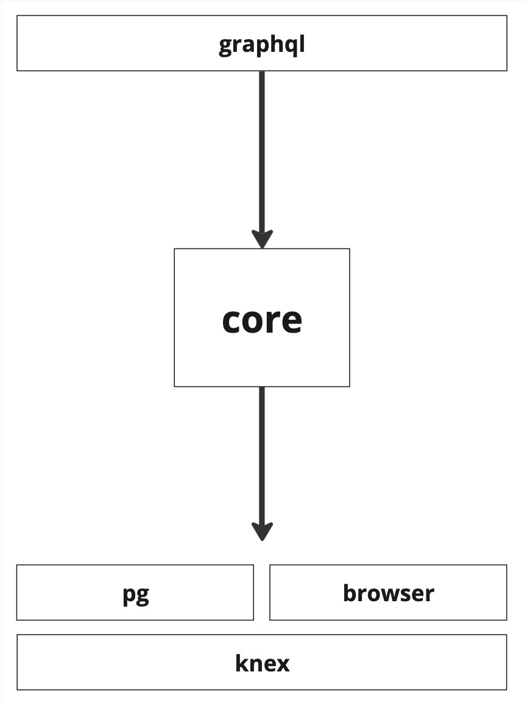
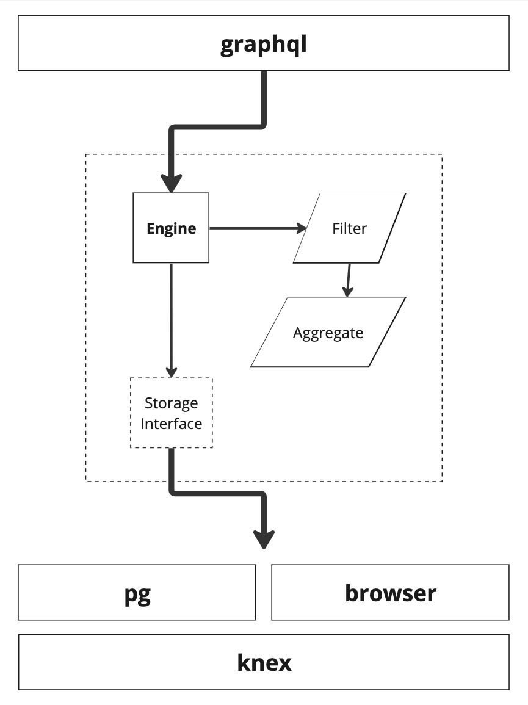

# Introduction

Welcome to the Powerhouse Analytics Engine API. This engine is a powerful, distributed, time-series analytics system, written in Typescript. It is designed to run anywhere: from browsers, to server environments, or even in embedded systems.

This documentation serves as a guide for API usage, not library development. For documentation on how to contribute to this project, see our [README](https://github.com/powerhouse-inc/analytics-engine/blob/main/README.md).

## Overview

The analytics system is broken into several modules, allowing developers to deploy across many environments, for a diverse set of use cases.



The `core` library contains common data types and abstractions used throughout. The job of the core library is to link together query, storage, and aggregation logic.



The `knex`, `pg`, and `browser` libraries contain various storage implementations. Finally, the `graphql` library contains types, resolvers, and data types for a GraphQL API on top.

# Quickstart

...

## Queries

Querying data is a good place to start.

For this purpose, we have created the [GraphQL](#graphql) package, which provides types and resolvers a GraphQL API. This quickstart will focus on making queries, but if you are interested in using this package with your own GraphQL server, see the section on `Apollo 4 Setup` in the [documentation below](#graphql).

## Querying with GraphQL

...

## Querying with Typescript API

The entry point for data queries in Typescript is the `AnalyticsQueryEngine`. This object exposes an interface for inserting, querying, and deleting metrics data.

This object should be created on top of a storage engine. In this example, we create a simple in-memory storage engine which is compatible with all platforms.

```typescript
import { AnalyticsQueryEngine } from "@powerhousedao/analytics-core";
import { MemoryAnalyticsStore } from "@powerhousedao/analytics-memory";

const engine = new AnalyticsQueryEngine(new MemoryAnalyticsStore());
```

## Insert Data

The GraphQL library is for querying data only.

The `IAnalyticsStore` interface is the primary entry point for inserting and deleting data. Multiple storage implementations are provided, but for simplicity we can get up and running quickly with the [`MemoryAnalyticsStore`](#memory).

```typescript
import { MemoryAnalyticsStore } from "@powerhousedao/analytics-engine-memory";

const store = new MemoryAnalyticsStore();
```

Data can be added using the `addSeriesValue` method.

> Note that we use the [`luxon` library](https://moment.github.io/luxon/#/) in our API for immutable, time-zone aware data types.

```typescript
import { DateTime } from "luxon";
import { AnalyticsPath } from "@powerhousedao/analytics-engine-core";

const source = AnalyticsPath.fromString("example/insert");
await store.addSeriesValue([
  {
    start: DateTime.utc(2021, 1, 1),
    source,
    value: 10000,
    unit: "DAI",
    metric: "budget",
    dimensions: {
      budget: AnalyticsPath.fromString("atlas/legacy/core-units/PE-001"),
      category: AnalyticsPath.fromString(
        "atlas/headcount/CompensationAndBenefits/FrontEndEngineering"
      ),
      project: source,
    },
  },
]);
```

## Store Implementations

Multiple storage implementations are provided, each with comprehensive documentation. See the corresponding docs for:

- [MemoryAnalyticsStore](#memory)
- [BrowserAnalyticsStore](#browser)
- [PostgresAnalyticsStore](#postgres)
